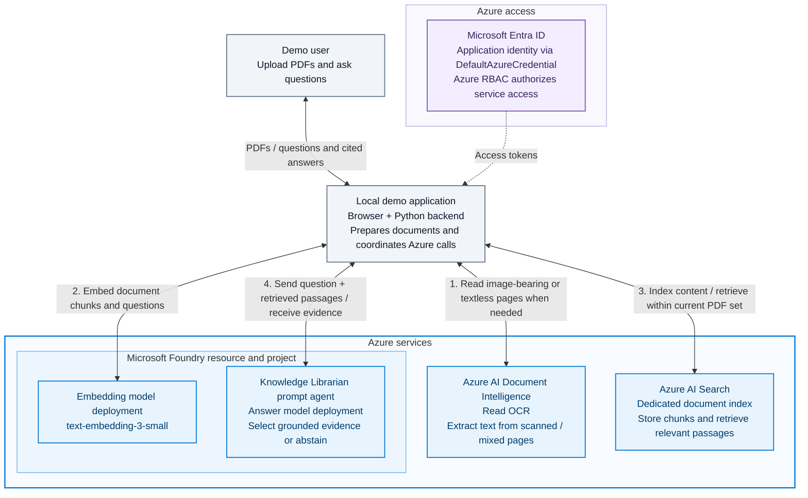

# Propel Microsoft Foundry PDF starter kit

Upload one or two PDFs, ask questions, and receive grounded evidence with
document and page citations. This self-contained demo helps the Propel Enablement
team explore Microsoft Foundry agents, Azure AI Search, embeddings, and OCR
without building an enterprise application.

**What you can try:** ask about a text-based PDF, read a scanned PDF using OCR,
compare evidence across two documents, and see an explicit response when the
sources do not support an answer. Answers are verbatim evidence quotes, not
free-form summaries.

## Architecture

The browser and Python backend run locally. The backend coordinates the
Azure services; the agent does not directly query Search or call OCR.
The editable diagram source is [`architecture.mmd`](architecture.mmd).



## Prerequisites

- Python **3.12**, Git, and Azure CLI.
- An Azure subscription and access to the resources below.
- An administrator who can create resources and assign Azure roles.

**Costs and data:** Azure AI Search generally incurs ongoing charges even when
idle. Model calls and OCR incur usage charges. Check regional pricing and quotas
before setup. Extracted text and vectors are stored in Search; retrieved passages
are sent to Foundry. PDFs needing OCR are sent to Document Intelligence with
selected pages requested for analysis. Use synthetic or approved documents only.

## Get started

### 1. Prepare the Azure resources and permissions

Have an administrator configure these resources manually. The running application
does not provision or delete Azure resources.

| Resource | Required configuration |
|---|---|
| Microsoft Foundry resource and project | A project supporting versioned prompt agents and the Responses API. Copy its project endpoint: `https://<resource>.services.ai.azure.com/api/projects/<project>`. |
| Answer-model deployment | A model supporting prompt agents, structured outputs, and the setup script's `temperature=0` setting, such as `gpt-4.1` where available. Record its deployment name for step 5. |
| Embedding deployment | Deploy `text-embedding-3-small` with **1536 dimensions**. Record its deployment name and resource endpoint: `https://<resource>.openai.azure.com`. |
| Azure AI Search | A vector-capable service with RBAC enabled. Create a **dedicated index** using [`search-index.json`](search-index.json), replacing the name placeholder. Basic or higher is a straightforward choice; verify regional support. No indexer, skillset, or semantic ranker is needed. |
| Azure AI Document Intelligence | An S0 OCR-capable resource supporting `prebuilt-read`. Copy its custom-subdomain endpoint: `https://<resource>.cognitiveservices.azure.com/`. The free tier's two-page analysis limit is unsuitable for this sample. |

Create the Search index through the portal's index JSON editor or the Search
data-plane REST API. [Additional setup details](docs/technical-guide.md#azure-setup-details)
are available if needed.

Assign roles to the **identity running the Python backend**:

| Scope | Role |
|---|---|
| Foundry project | **Azure AI User** for runtime agent/model access. Verify inherited deployment access; add **Cognitive Services OpenAI User** on the Foundry resource if required for inference. Agent creation in step 5 requires separate developer/administrator permissions. |
| Search service | **Search Index Data Contributor** for querying and changing document records; **Search Service Contributor** for the startup schema check. The latter grants broader rights than the app uses; a custom schema-read role can reduce them. |
| Document Intelligence resource | **Cognitive Services User**, or another role granting document-analysis access. |

Allow workstation access through service firewalls/private networking, and allow
time for role assignments to propagate.

### 2. Clone and install

```bash
git clone https://github.com/mkabukcu7/foundry-pdf-starter-kit.git
cd foundry-pdf-starter-kit
python -m venv .venv
```

Activate the environment:

```bash
# macOS / Linux
source .venv/bin/activate
```

```powershell
# Windows PowerShell
.\.venv\Scripts\Activate.ps1
```

Then install the pinned dependencies:

```bash
python -m pip install -r requirements.txt
```

### 3. Configure the resource settings

Copy `.env.example` to `.env`:

```bash
# macOS / Linux
cp .env.example .env
```

```powershell
# Windows PowerShell
Copy-Item .env.example .env
```

Fill in the six resource/deployment settings below. Leave the two agent settings
as placeholders until step 5.

| Setting | Value |
|---|---|
| `FOUNDRY_PROJECT_ENDPOINT` | Foundry project endpoint |
| `FOUNDRY_EMBEDDING_MODEL` | Embedding deployment name |
| `FOUNDRY_EMBEDDING_ENDPOINT` | Resource's Azure OpenAI endpoint, not the project URL |
| `SEARCH_ENDPOINT` | `https://<search-service>.search.windows.net` |
| `SEARCH_INDEX_NAME` | Dedicated index name |
| `DOCUMENT_INTELLIGENCE_ENDPOINT` | OCR resource's custom-subdomain endpoint |

No API keys or credentials belong in `.env`. Environment variables take
precedence over the file.

### 4. Sign in to Azure

```bash
az login
az account set --subscription "<your-subscription-id>"
```

The backend uses `DefaultAzureCredential` for Entra authentication to Azure,
typically using this CLI login locally. The agent setup command uses the Azure
CLI identity explicitly.

### 5. Create the dedicated agent

Run this explicit setup command with an identity authorized to create agents:

```bash
python -m app.setup_agent --name pdf-knowledge-librarian --model "<answer-deployment-name>"
```

It creates and verifies a prompt-agent version with the grounding instructions,
strict evidence JSON schema, and no tools. This is a deliberate Azure configuration
change, not part of app startup. It refuses an existing name unless you explicitly
request a new version with `--new-version`.

Copy the two printed values into `.env`:

```dotenv
FOUNDRY_AGENT_NAME=<printed-agent-name>
FOUNDRY_AGENT_VERSION=<printed-agent-version>
```

Use a dedicated agent for this sample. If another administrator creates it,
ask them for the saved name/version configured by this script.

### 6. Run the app

```bash
python -m uvicorn app.main:app --host 127.0.0.1 --port 8000 --workers 1
```

Open **http://127.0.0.1:8000**. Keep the terminal open; press Ctrl+C to stop.
Run exactly one worker and one copy of the app per dedicated Search index.

### 7. Try the sample

Upload [`samples/moonflower.pdf`](samples/moonflower.pdf), then ask:

| Question | Expected result |
|---|---|
| How long does the Moonflower workshop last? | 45 minutes, cited to page 1. |
| Who owns the workshop, and how long is the upload-and-questions activity? | Propel Enablement team and 20 minutes, cited to page 2. |
| What is the workshop's catering budget? | **"The document does not support an answer to this question."** |

For your own demo, upload one or two PDFs **together**. Each upload replaces the
entire current set for every tab. Each PDF must have a distinct filename and fit
within **5 MiB and 50 pages**; the set is limited to **500 chunks**.
Scanned/mixed PDFs add OCR processing time. The UI shows the active sources and
renders evidence quotes with document/page citations.

## Foundational concepts

| Concept | What this sample demonstrates |
|---|---|
| Agent | One versioned Foundry prompt agent: an answer model plus instructions that select evidence or abstain. |
| Grounding | Answers use only retrieved passages from the current PDF set, not general knowledge or previous turns. |
| Chunking | Each page is split into 1200-character passages with 150-character overlap, preserving its page number. |
| Embeddings | The embedding model turns text into 1536-number vectors representing its meaning. |
| Retrieval | Azure AI Search combines keyword and vector search, filtered to the current documents. |
| Citations | The backend validates each quote and builds its filename/page citation from indexed metadata. |
| Authentication | Entra tokens authenticate the backend to Azure; RBAC authorizes operations. This is not browser-user sign-in. |

## Demo boundaries

This is a **single-user, local-only learning sample**, not a production service.
Do not expose it on a network, use a reverse proxy, or run multiple workers.
It includes no SharePoint integration, classification, approvals, write-back,
MCP, Fabric, or conversation history.

Answers are deliberately extractive. Retrieval considers up to five passages
per PDF, so it can miss evidence. An unsupported response is not proof that the
entire document lacks an answer. PDF instructions are treated as untrusted data;
the safeguards do not guarantee immunity to prompt injection.

Citations use physical PDF page numbers, not printed page labels. OCR can misread
text and numbers; complex layout and table structure are not interpreted.
Review important facts against the original PDF.

Content remains in Search after shutdown. Replacement removes tracked old records;
keep the ignored `.runtime/state.json` cleanup ledger. Invalid PDFs leave the
current set unchanged; a replacement indexing failure disables Q&A until a
successful upload. Do not delete the ledger to resolve an error.

## Troubleshooting and further reading

| Symptom | First check |
|---|---|
| Startup fails or an Azure service returns 401/403 | Check `.env`, CLI tenant/login, role assignments, and network access. |
| Foundry returns 404 or rejects the response format | Check deployment names and agent name/version; create the agent using step 5. |
| Search schema error | Use the supplied index schema and 1536-dimensional embedding deployment. |
| Q&A is unavailable after a failed replacement | Check server logs, correct the failure, and retry upload. Preserve `.runtime`. |
| An answer is unexpectedly unsupported | Wait briefly after indexing, then ask a specific question supported by the text. |
| A tab reports HTTP 409 | Refresh; another upload replaced its document set. |

See the [technical guide](docs/technical-guide.md) for complete troubleshooting,
ingestion/recovery details, SDK notes, and VS Code debugging.
See [testing and verification](docs/testing.md) for local test commands and
the recorded live Azure smoke checks. The current local suite has **65 passing
tests**; that is distinct from live service validation.
