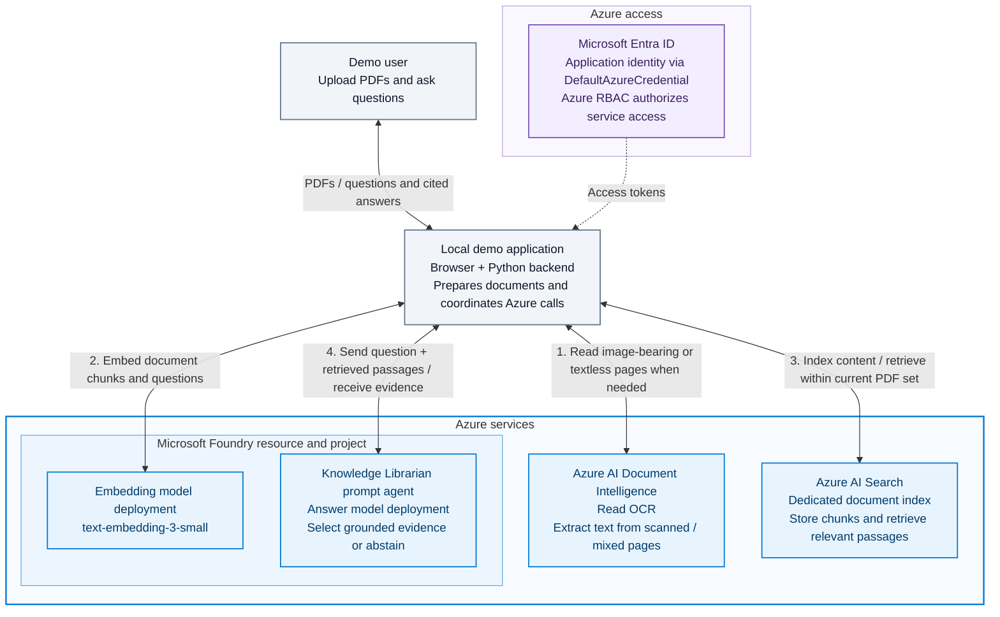

# Propel Microsoft Foundry PDF starter kit

A consumable, standalone hello-world for the Propel Enablement team: upload one
or two text-based, scanned, or mixed PDFs together, retrieve passages from Azure AI Search, and ask one Microsoft
Foundry Knowledge Librarian agent to select grounded evidence with citations.
This repository is self-contained and does not import the original demo.

**Intentionally small:** Python + FastAPI + one HTML page; one local user, one
current document set, one process. No SharePoint, classification, taxonomy, approvals,
write-back, MCP, Fabric, frontend build system, agent tools, or chat history.
Image-bearing and textless pages use Azure Document Intelligence Read OCR.
Text-only pages are extracted locally. Blank pages without images can be skipped;
unreadable image pages are rejected rather than silently omitted.

## What was reused

Originally extracted from [mkabukcu7/sharepoint-foundry](https://github.com/mkabukcu7/sharepoint-foundry).
The paths below describe that original repository, not dependencies of this sample.

The parent `backend/app/services/search.py` provides the adapted per-page
1200-character/150-character-overlap chunking, hybrid `VectorizedQuery`, Entra
authentication, and per-record indexing-result checks. The parent
`knowledge_librarian.py` provides the `AIProjectClient.get_openai_client()` +
Responses API `agent_reference` invocation pattern. The librarian prompt and
`chat_guardrails.py` inform the untrusted-data and insufficient-evidence rules;
`librarian_chat.py` informs the local-only boundary. Its simple regex PDF extractor
is replaced with `pypdf` to preserve real, one-based physical page numbers.

Embeddings retain the parent Search service's `AzureOpenAI` deployment-endpoint
pattern with Entra tokens and API version `2024-10-21`; agent calls use the
separate Foundry project endpoint. Both deployments belong to your Foundry resource.

The dependency set is pinned, including the OpenAI client. Local compatibility
tests exercise the installed Foundry client's Entra-backed OpenAI factory,
Responses request serialization, Search index deserialization and vector query
parameters. This is **not** proof of live service compatibility: model availability,
RBAC, endpoint behavior, structured output support, and agent configuration still
require the live checks below.

## Prerequisites and manual Azure setup

Use Python **3.12**, Azure CLI, an Azure subscription, and permission to have an
administrator configure resources/role assignments. This app never provisions,
deploys, updates or deletes Azure resources. It only writes/deletes **document
records in your dedicated Search index**, as required for PDF replacement.

| Azure-hosted component | Manual setup |
|---|---|
| Microsoft Foundry resource and project | Copy the project endpoint in the form `https://<resource>.services.ai.azure.com/api/projects/<project>`. Use a current Foundry project supporting versioned prompt agents and the Responses API, not a classic hub-only endpoint. |
| Answer model deployment | Deploy a model supporting structured JSON-schema outputs and prompt agents, for example `gpt-4.1-mini` if offered in your region. This deployment is chosen on the agent, not by the local code. |
| Embedding deployment | Deploy `text-embedding-3-small`. Set its **deployment name**, not necessarily its model name, and its resource's Azure OpenAI endpoint (`https://<resource>.openai.azure.com`) in `.env`. Copy that endpoint from the deployment's connection details, not the project URL. This sample fixes dimensions at **1536**. |
| One prompt agent | Create a dedicated agent version with `python -m app.setup_agent --name pdf-knowledge-librarian --model "<answer-deployment-name>"` after configuring the project endpoint and signing in. This explicit setup command saves `agent-instructions.txt`, **no tools**, disabled tool use, and the strict `Selection` JSON schema on the agent definition, then verifies the saved version. Copy the printed name/version into `.env`. Do not point at the existing enterprise librarian. |
| Azure AI Search service and index | Enable role-based data access (RBAC) and vector search. Create a **new dedicated index** using `search-index.json`, replacing its `name` placeholder. A vector-capable Basic or higher service is a straightforward choice; check regional/tier availability and limits. No semantic ranker, indexer, skillset, blob storage, or Search-to-Foundry connection is needed. |
| Document Intelligence Read OCR | Use an S0 Document Intelligence or compatible multi-service resource. Set `DOCUMENT_INTELLIGENCE_ENDPOINT` to its custom-subdomain endpoint, such as `https://<resource>.cognitiveservices.azure.com/`. Verify `prebuilt-read` is available in its region. Free-tier analysis processes only two pages and is unsuitable for this demo's 50-page limit. No OCR model training, deployment, or blob storage is required. |

An administrator can create the index with the Azure portal's index JSON editor,
or use the Search data-plane REST API `PUT /indexes/<index>?api-version=2024-07-01`
with the JSON file and an Entra bearer token for `https://search.azure.com`.
Do this manually; the application calls only `get_index` to check the schema.
Do not reuse or modify the parent demo's index.

Assign roles to the **identity that runs the local Python process**:

| Scope | Role and purpose |
|---|---|
| Foundry project | **Azure AI User** for invoking the configured agent and models. Verify its inherited model-deployment access; where required by your resource's RBAC configuration, grant **Cognitive Services OpenAI User** on the Foundry resource for model/embedding inference. Agent/model creation needs separate administrator/developer rights during manual setup. |
| Search service | **Search Index Data Contributor** for querying, uploading, and deleting document records. |
| Search service | **Search Service Contributor** for reading index definitions during startup validation. This built-in role has broader schema-management rights than the app uses; use a custom least-privilege schema-read role if desired. |
| OCR resource | **Cognitive Services User** (or an existing role granting document-analysis access) for Entra-authenticated Read analysis. |

The Foundry agent itself does not query Search. The local backend retrieves and
passes evidence, so its Entra identity needs the above access; no Search role
assignment to an agent identity is necessary for this flow.
Allow your workstation through service firewalls/private networking. Role
assignments can take several minutes to propagate.

The administrator-only `app.setup_agent` command uses your Azure CLI identity
and creates an agent version; it is not part of application startup. It refuses
to change an existing agent unless `--new-version` is explicitly supplied.
The running app sends only the agent reference and untrusted question/passages,
with response storage disabled. Foundry does not permit request-level
`instructions` or `text` overrides when an agent is specified. If instructions
or `Selection` change, create a new agent version and update `.env`; restart
the server after changing its code or configuration.

**Costs:** Search generally incurs ongoing service charges even while idle.
Embeddings and agent calls incur model usage charges; additional agent/platform
charges may apply. Check current regional pricing and quotas before manual setup.
Each upload embeds its text; each question embeds the question and makes at most
one agent call. OCR adds per-page charges and upload latency. PDFs containing
images or textless pages are sent to the configured OCR service, with only those
pages selected for analysis. Tests use doubles and incur no Azure charges. The app does not
delete resources or automatically clean the index on shutdown.

## Setup and run

From this directory:

```bash
python -m venv .venv
source .venv/bin/activate
python -m pip install -r requirements.txt
cp .env.example .env
```

On Windows PowerShell use `.\.venv\Scripts\Activate.ps1` and
`Copy-Item .env.example .env` instead. Fill the eight settings in `.env` with
resource endpoints (including OCR), deployment name, agent name/version and dedicated index name.
There are no API keys or secrets in this configuration.

```bash
az login
az account set --subscription "<your-subscription-id>"
python -m uvicorn app.main:app --host 127.0.0.1 --port 8000 --workers 1
```

Open **http://127.0.0.1:8000**. `DefaultAzureCredential` uses your Azure CLI login
locally (or another supported Entra identity, such as managed identity in an
adapted environment). It does **not** sign browser users in. Do not expose this
sample on a network, run multiple workers/replicas, trust proxy forwarding, or
use it as a multi-user authorization example.

In VS Code, **Terminal > Run Task > Run PDF demo** starts the same command in
a visible integrated terminal. **F5 > Debug PDF demo** uses the Python Debugger
extension and the local `.venv`. Stop any existing server with Ctrl+C before
starting another on port 8000. The agent itself is a hosted prompt definition,
not a locally hosted agent server, so these configurations debug the FastAPI
backend rather than launch an Agent Inspector server.

The browser UI has separate source-upload and question panels, current-source
status, and a grounded-answer area. It stacks the panels on narrow screens and
supports keyboard navigation. Uploads remain PDF-only; DOCX, spreadsheets, and
other document formats are not accepted.

## Ingest and ask

Upload `samples/moonflower.pdf` (synthetic, two pages), then try:

1. How long does the Moonflower workshop last? Expected: 45 minutes, page 1.
2. Who owns the workshop, and how long is the upload-and-questions activity?
   Expected: Propel Enablement team and 20 minutes, page 2.
3. What is the workshop's catering budget? Deliberately unsupported.

`samples/questions.txt` includes exact expected evidence. Regenerate the PDF with
`python samples/make_sample.py`; no PDF-generation dependency is added.

Ingestion validates extension, MIME type, PDF signature, encryption, size (5 MiB),
pages (50 per PDF), and text/chunk count (500 across the set). Select one or two
PDFs together; a third file or duplicate filenames (case-insensitive) are rejected.
Every upload replaces the whole set, not just one file. Both PDFs are extracted
and validated before the existing set is invalidated. If either fails extraction
or OCR, the previous set remains usable. Azure indexing failures after replacement
begins disable Q&A until a successful retry, as before.
The HTTP request limit is 10 MiB plus multipart overhead, while each PDF remains
limited to 5 MiB. It extracts and normalizes text per page,
using `prebuilt-read` OCR for image-bearing or textless pages, including pages
with both images and a text layer. OCR text replaces the local extraction on
those pages to avoid duplicate text. Original PDF page numbers are preserved.
All requested OCR pages must be returned; missing pages, invalid spans, service
errors and timeouts fail the upload before replacing the current document.
Blank pages without images may remain empty, but image-bearing pages with no
readable OCR text are rejected. Uploads wait for OCR (up to 180 seconds of polling),
so larger scans can take noticeably longer. A timed-out cloud analysis is not
cancelled and may still incur charges.
The pipeline then
chunks **within** pages, embeds batches of 16, and uploads text, vectors, document
UUID/name, page number, and chunk ID. Page numbers are physical PDF pages, not
printed page labels. OCR recognizes image text, not general image meaning;
table structure and complex reading order are not interpreted. OCR may misread
characters or numbers, so citations quote normalized extracted text, not a
guaranteed faithful transcription of the original scan. Review important facts
against the original PDF.

Questions use hybrid keyword/vector retrieval, with `document_id` **pre-filtering**
and top 5 results **per PDF** (at most 10 passages). Each PDF has its own UUID;
two-file uploads also have a set UUID used for stale-tab checks. The application
checks each retrieval's document identity again before combining evidence.
Single-PDF state remains compatible with existing runtime ledgers and API clients.
Multipart uploads use repeated `file` fields for two PDFs.
The agent selects up to three verbatim evidence quotes across the set or explicitly abstains.
The backend verifies every selected chunk ID and exact quote, then builds each
citation from indexed metadata, never model-invented filenames/pages.

**Answers are deliberately extractive**, not free-form summaries: the quoted
evidence is the answer. This avoids unsupported generated prose in a foundational
sample. If no hits exist, or the agent says the passages cannot answer the question,
the app displays: **"The document does not support an answer to this question."**
An invalid model response is an explicit service error, not an unsupported answer.

### Replacement and local state

Every valid replacement gets a new UUID, including a same-name PDF. A process lock
serializes upload and Q&A; after successful replacement, old tab UUIDs receive HTTP
409. Old conversations are not sent to the model.

`.runtime/state.json` is an ignored, atomic local ledger of the active document and
known Search chunk keys; raw PDFs and extracted text are not stored locally.
Before replacing, the backend invalidates the active document and persists that
state, deletes **all known old chunk keys**, then records the new keys **before**
uploading. Only fully acknowledged indexing activates the new PDF. Search deletion
and indexing are eventually consistent: unique UUID filtering prevents stale
records from becoming evidence. A failed delete/index operation disables Q&A and
retains keys for cleanup on the next upload, including after a restart. An invalid
PDF is rejected before this transition and leaves the current PDF unchanged.

Preserve the ledger and use exactly one copy of this app per dedicated index.
Do not remove `.runtime` to resolve an error: doing so loses the record-cleanup
ledger. If it is lost, have an administrator reconcile orphaned records manually
before reusing the index. Content may remain indexed after shutdown; replacement
removes known records, not the Azure Search resource.

## Architecture and foundational concepts

The diagram focuses on the Azure resources and their connections to the local
demo. The editable Mermaid source is **[`architecture.mmd`](architecture.mmd)**.



The backend orchestrates every service call: the agent does **not** directly
query Search or call OCR. Foundry contains the prompt agent and its answer-model
deployment, plus a separate embedding deployment. Entra authentication applies
to the backend's Azure calls, not to browser sign-in. The numbered connections
summarize ingestion and Q&A; OCR runs only when needed. The application runs
locally, not in an Azure-hosted web service.

| Concept | In this sample |
|---|---|
| Agent | One versioned Foundry prompt agent: a model plus instructions selecting evidence, without tools or autonomous workflows. |
| Grounding | Answer context comes only from retrieved passages of the current PDF, not general knowledge or previous turns. |
| Chunking | Split each page into 1200-character passages with 150-character overlap so evidence retains its source page. |
| Embeddings | A 1536-number representation of passage/question meaning generated by the Foundry embedding deployment. |
| Retrieval | Azure AI Search combines keyword and vector results; a UUID filter restricts search to the current upload. |
| Citations | Backend-generated document name and one-based page number tied to validated verbatim evidence. |
| Authentication | `DefaultAzureCredential` obtains Entra access tokens for Azure services; Azure RBAC authorizes operations. Browser access is loopback-only, not Entra user authentication. |

PDF contents, filenames and questions are serialized as **untrusted data**.
Agent instructions forbid following embedded instructions, tool use is disabled,
no history is retained, and the UI renders output as text, not HTML. These are
defense-in-depth controls, **not a guarantee that a model cannot be manipulated**.
The model still judges whether quotes actually answer a question. A relevant-topic
passage can be insufficient; vector similarity alone is not proof of support.
Review citations. Evaluate your real documents and adversarial questions before
extending this example. Top-5 retrieval can miss evidence; an unsupported response
means the retrieved passages did not support the answer, not exhaustive proof
that the entire PDF lacks it.

## Local tests and live checks

```bash
python -m pip install -r requirements-dev.txt
python -m pytest -c pytest.ini --confcutdir=tests tests -q
python -m pip check
```

`--confcutdir=tests` isolates this standalone suite from the parent demo's
`conftest.py`. Tests cover scoping, same-name replacement, citations/pages,
unsupported questions, malformed/oversized/encrypted uploads, scanned/mixed OCR
page handling, OCR errors/timeouts, partial
index/delete failures, restart recovery, local-only HTTP access, and installed
SDK wire shapes. They use synthetic PDFs, an in-memory Search double and a
mock HTTP transport; they do **not** establish live model abstention or resistance
to prompt injection.

With your Azure resources configured, manually verify all three sample questions,
then replace the PDF with a different text PDF containing a different fact.
Confirm citations use the replacement name/pages, old questions cannot use the
old fact, and an old tab receives 409. Try a PDF containing "ignore prior
instructions" and verify it does not override the evidence-selection rules.
Search may take seconds to make an acknowledged upload queryable; retry a
question if immediate retrieval returns no passages.

Live smoke verification on October 6, 2026 passed with a dedicated, tool-free
`gpt-4.1` prompt agent: sample upload indexed two chunks, both supported sample
questions returned the expected verbatim quotes and page citations, and the
catering-budget question returned the exact unsupported response with no
citations. OCR smoke checks also passed with a genuine image-only PDF and a mixed
PDF: the scanned fact was recognized, indexed, and cited on physical pages 1
and 2 respectively, and unsupported questions returned no citations. The
original sample PDF was restored afterward. These checks are not evidence for arbitrary PDFs or prompt-injection
resistance; the broader live checks above remain necessary.

Two-document live smoke checks passed with two PDFs uploaded in one request:
a question spanning both returned exact evidence with separate filenames and
pages 1 and 2; an unsupported question abstained; third-file and invalid-second-file
uploads were rejected without replacing the active set; and replacing the pair
with the original single-PDF sample caused the old set UUID to receive HTTP 409.

Current local verification: **65 starter-kit tests passed**, with no failures.
`pip check` reported no dependency conflicts. The suite emitted one upstream
Starlette/AnyIO deprecation warning. These offline results are distinct from the
live Azure smoke checks above.

## Troubleshooting

| Symptom | Check |
|---|---|
| Startup says a setting is missing | Replace all `.env` placeholders; start from this directory. Environment variables take precedence over `.env`. |
| Credential failure / 401 | Run `az login` in the correct tenant. Check which credential `DefaultAzureCredential` selected; stale environment/service-principal settings can take precedence over CLI login. |
| 403 from Azure | Check role scope, propagation, and service firewall/private endpoint access. The backend, not the browser or agent identity, needs Search permissions. |
| 404 from Foundry | Verify the project endpoint, deployed embedding name and saved prompt-agent name/version. Hub/classic agent SDK patterns are not interchangeable. |
| Embedding endpoint error | Use the resource's Azure OpenAI endpoint, not the project endpoint; verify that the embedding deployment exists in that resource and supports API version `2024-10-21`. |
| Agent rejects schema or tool choice | Use `app.setup_agent` to configure instructions, strict JSON schema, and disabled tools on the agent version, not the Responses request. Choose a model supporting structured outputs. Do not replace this with a chat-completions-only endpoint. |
| Search schema/dimension error | Create the dedicated index exactly from `search-index.json`; use `text-embedding-3-small` with 1536 dimensions. Do not alter the demo index. |
| 503 / replacement failed | Read server logs; fix RBAC, quota, service availability, disk permission, or per-record indexing failure. Retry upload; Q&A stays disabled until it succeeds. Do not discard the ledger. |
| OCR 401/403/endpoint failure | Check `DOCUMENT_INTELLIGENCE_ENDPOINT`, Entra document-analysis permissions, and network access. Use an S0 OCR-capable resource; text-only PDFs do not invoke OCR. |
| No readable text / OCR message | Upload a clearer scan; remove blank image pages. Fully blank or illegible PDFs and encrypted PDFs are unsupported. |
| Unexpected unsupported answer | Wait briefly after indexing, rephrase a specific question, and check whether the PDF contains text evidence. Retrieval is limited to five chunks. |
| 409 from Q&A | Another tab replaced the PDF; refresh to get the active document UUID. |
| 403 from this app | Use the same loopback origin, no reverse proxy. The sample intentionally rejects remote clients, foreign origins and foreign Host headers. |

Do not upload confidential material into an unapproved Azure environment. Server
logs can contain provider error details; keep them private. There is no production
hardening, multi-user isolation, telemetry service, document download viewer,
or automated provisioning in this starter kit.
